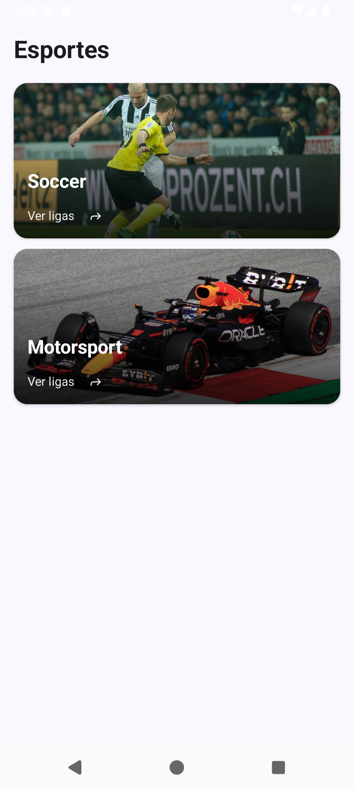
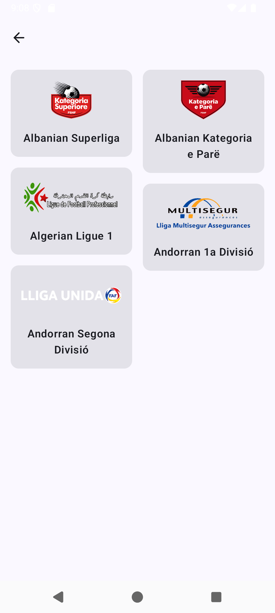
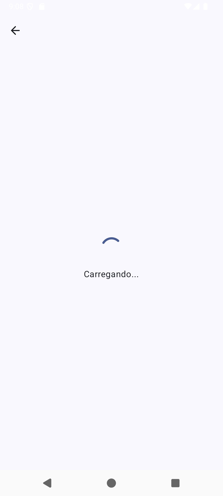

# Herofit Brasil - Sports Explorer

Aplicativo Android para exploração de esportes e ligas, desenvolvido como desafio técnico utilizando Clean Architecture e MVVM.

## 📱 Sobre o Projeto

Este é um explorador de esportes que consome a API pública [TheSportDB](https://www.thesportsdb.com/), permitindo aos usuários:

- Visualizar lista de esportes disponíveis
- Explorar ligas de cada esporte
- Ver detalhes completos de cada liga (descrição, país, redes sociais, etc.)

## 📸 Screenshots

<div style="text-align: center;">
  
  
  
  
  
</div>

## 🏗️ Arquitetura

O projeto segue os princípios de **Clean Architecture** com **MVVM**, organizado em três camadas principais:

### Camadas
```
app/
├── data/              # Camada de Dados
│   ├── remote/        # API e responses
│   ├── repository/    # Implementação dos repositórios
│   └── mapper/        # Conversão de DTOs para Domain
├── di/		           # Injeção de dependências
├── domain/            # Camada de Domínio
│   ├── model/         # Entidades de negócio
│   ├── repository/    # Interfaces dos repositórios
│   └── usecase/       # Casos de uso (regras de negócio)
└── presentation/      # Camada de Apresentação
    ├── ui/            # Telas Compose
    ├── viewmodel/     # ViewModels
    ├── model/         # Modelos de UI
    └── navigation/    # Navegação
```

### Decisões Arquiteturais

1. **MVVM + Clean Architecture**
   - Separação clara de responsabilidades
   - Facilita testes e manutenção
   - Baixo acoplamento entre camadas

2. **Repository Pattern**
   - Abstração da fonte de dados
   - Facilita troca de implementação (API, local, mock)

3. **Use Cases**
   - Encapsulam lógica de negócio
   - Reutilizáveis e testáveis
   - Single Responsibility Principle

4. **StateFlow para UI**
   - Reativo e lifecycle-aware
   - Gerenciamento de estado simplificado

5. **Result Pattern**
   - Tratamento de erros explícito
   - Sem exceptions não tratadas

## 🛠️ Tecnologias e Bibliotecas

### Core
- **Kotlin** - Linguagem principal
- **Jetpack Compose** - UI moderna e declarativa
- **Coroutines** - Programação assíncrona
- **Flow** - Streams reativos

### Arquitetura
- **Hilt** - Injeção de dependência
  - Reduz boilerplate
  - Integração nativa com Android
  - Facilita testes

### Rede
- **Retrofit** - Cliente HTTP
  - Maturidade e confiabilidade
  - Fácil configuração
- **Gson** - Serialização JSON
  - Performance
  - Simplicidade
- **OkHttp** - Cliente HTTP subjacente
  - Logging de requisições
  - Interceptors

### UI
- **Material 3** - Design System
- **Coil** - Carregamento de imagens assíncrono
  - Integração com Compose
  - Cache automático
- **Navigation Compose** - Navegação entre telas

### Testes
- **JUnit** - Framework de testes
- **MockK** - Mocking para Kotlin
  - DSL idiomática do Kotlin
  - Suporte a coroutines
- **Coroutines Test** - Testes de código assíncrono
- **Arch Core Testing** - Testes de componentes Architecture

## 📋 Funcionalidades

- ✅ Listagem de esportes
- ✅ Listagem de ligas por esporte
- ✅ Detalhes da liga
- ✅ Estados de Loading, Success e Error
- ✅ Tratamento de ausência de internet
- ✅ Links para redes sociais
- ✅ Design responsivo

## 🧪 Testes

O projeto inclui:

### Testes Unitários
- `MainViewModelTest` - Testa o ViewModel principal
  - Estados de sucesso e erro
  - Transformação de dados

### Testes de Integração
- `SportsRepositoryImplTest` - Testa o Repository
  - Integração com API
  - Tratamento de erros de rede
- `LeagueDetailMapperTest` - Testa mapeamento de dados

### Executar os testes
```bash
./gradlew test
```

## 🚀 Como Executar

### Pré-requisitos
- Android Studio Hedgehog ou superior
- JDK 17
- Gradle 8.0+

### Passos

1. Clone o repositório
```bash
git clone https://github.com/neresfelip2/Herofit.git
```

2. Abra o projeto no Android Studio

3. Sincronize o Gradle
```bash
./gradlew sync
```

4. Execute o app
```bash
./gradlew installDebug
```

Ou use o botão Run no Android Studio.

## 📦 Build

### Debug
```bash
./gradlew assembleDebug
```

### Release
```bash
./gradlew assembleRelease
```

## 🔄 Gerenciamento de Estado

O app utiliza `sealed class UIState<T>` para gerenciar os estados da UI:
```kotlin
sealed class UIState<out T> {
    object Loading: UIState<Nothing>()
    data class Success<T>(val data: T) : UIState<T>()
    data class Error(val description: String) : UIState<Nothing>()
}
```

Cada tela observa um `StateFlow<UIState<T>>` e renderiza o componente apropriado.

## 🌐 Tratamento de Erros

O app diferencia tipos de erro:
- **Sem internet**: "Sem conexão com a internet"
- **Timeout**: "Tempo de conexão esgotado"
- **Outros**: Mensagem específica da exceção

## 📱 Compatibilidade

- **Min SDK**: 24 (Android 7.0)
- **Target SDK**: 36 (Android 16)
- **Compile SDK**: 36

## 🎨 Design

O app segue as diretrizes do Material Design 3, com:
- Temas adaptativos
- Cores dinâmicas
- Componentes modernos

## 👤 Autor

Felipe Neres Ribeiro
- GitHub: [@neresfelip2](https://github.com/neresfelip2)
- LinkedIn: [Felipe Neres](https://linkedin.com/in/neresfelip)

## 📄 Licença

Este projeto foi desenvolvido como desafio técnico.
